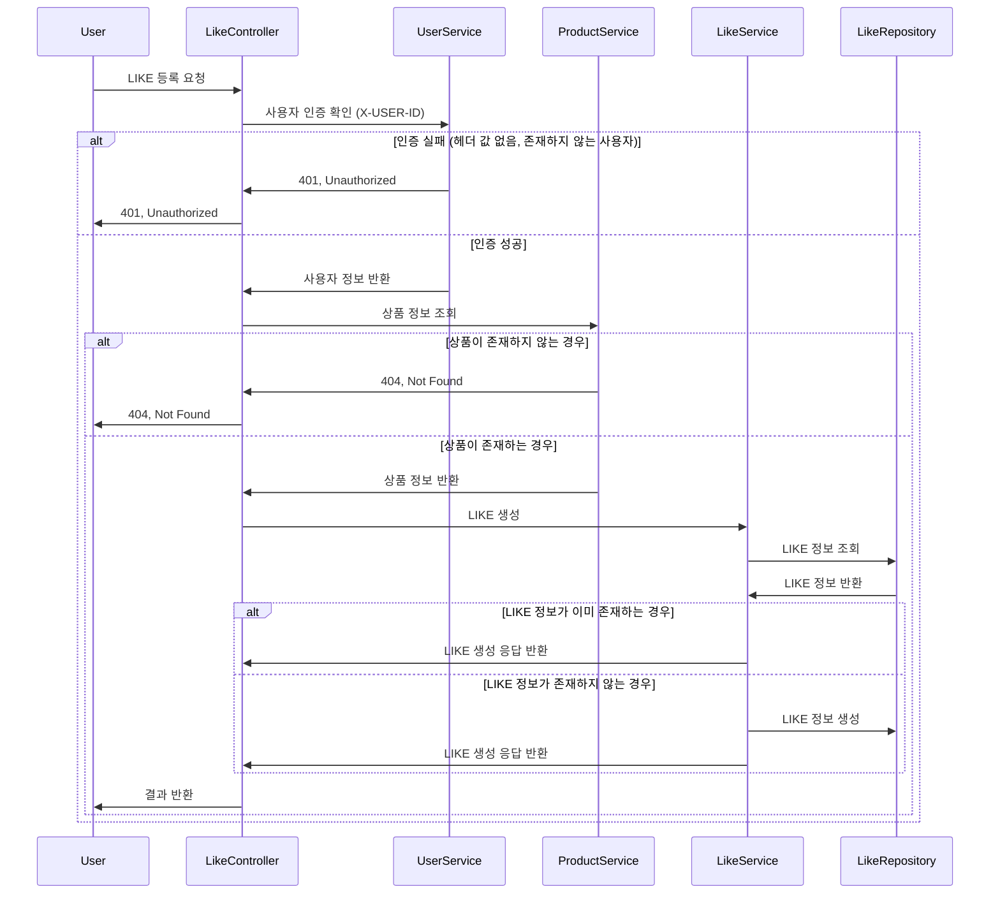
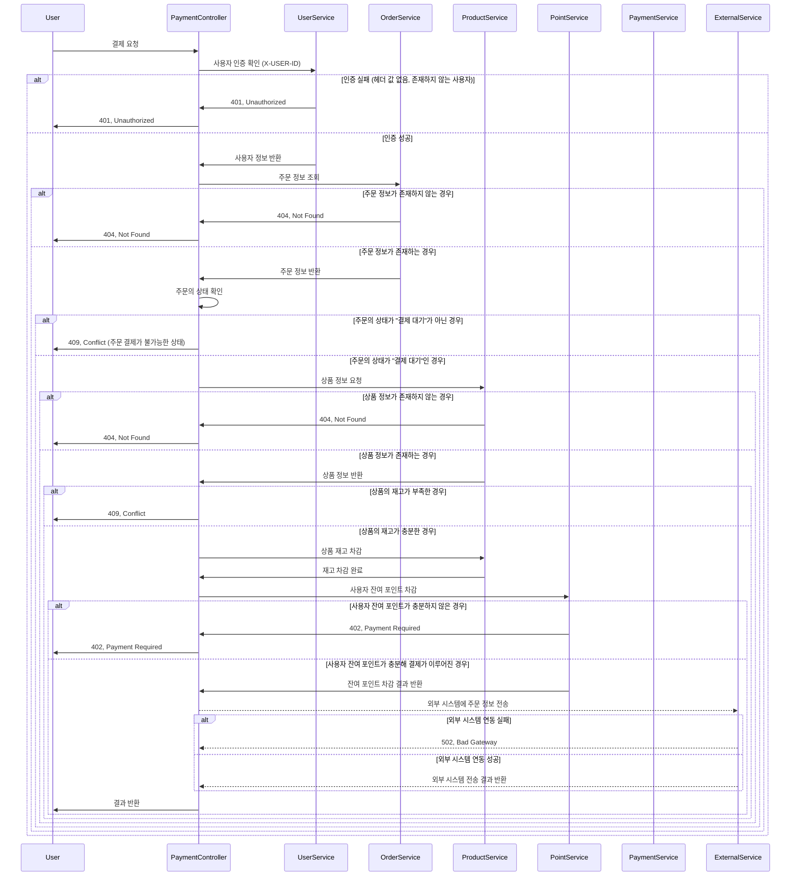

## 상품 LIKE 등록 SequenceDiagram

```mermaid
sequenceDiagram
    participant User
    participant LikeController
    participant UserService
    participant ProductService
    participant LikeService
    participant LikeRepository
    User ->> LikeController: LIKE 등록 요청
   LikeController ->> UserService: 사용자 인증 확인 (X-USER-ID)
    alt 인증 실패 (헤더 값 없음, 존재하지 않는 사용자)
        UserService ->> LikeController: 401, Unauthorized
        LikeController ->> User: 401, Unauthorized
    else 인증 성공
        UserService ->> LikeController: 사용자 정보 반환
        LikeController ->> ProductService: 상품 정보 조회
        alt 상품이 존재하지 않는 경우
            ProductService ->> LikeController: 404, Not Found
            LikeController ->> User: 404, Not Found
        else 상품이 존재하는 경우
            ProductService ->> LikeController: 상품 정보 반환
            LikeController ->> LikeService: LIKE 생성
            LikeService ->> LikeRepository: LIKE 정보 조회
            LikeRepository ->> LikeService: LIKE 정보 반환
            alt LIKE 정보가 이미 존재하는 경우
                LikeService ->> LikeController: LIKE 생성 응답 반환
            else LIKE 정보가 존재하지 않는 경우
                LikeService ->> LikeRepository: LIKE 정보 생성
                LikeService ->> LikeController: LIKE 생성 응답 반환
            end
            LikeController ->> User: 결과 반환
        end
    end
```

## 결제 처리 SequenceDiagram

```mermaid
sequenceDiagram
    participant User
    participant PaymentController
    participant UserService
    participant OrderService
    participant ProductService
    participant PointService
    participant PaymentService
    participant ExternalService
    User ->> PaymentController: 결제 요청
    PaymentController ->> UserService: 사용자 인증 확인 (X-USER-ID)
    alt 인증 실패 (헤더 값 없음, 존재하지 않는 사용자)
        UserService ->> PaymentController: 401, Unauthorized
        PaymentController ->> User: 401, Unauthorized
    else 인증 성공
        UserService ->> PaymentController: 사용자 정보 반환
        PaymentController ->> OrderService: 주문 정보 조회
        alt 주문 정보가 존재하지 않는 경우
            OrderService ->> PaymentController: 404, Not Found
            PaymentController ->> User: 404, Not Found
        else 주문 정보가 존재하는 경우
            OrderService ->> PaymentController: 주문 정보 반환
            PaymentController ->> PaymentController: 주문의 상태 확인
            alt 주문의 상태가 "결제 대기"가 아닌 경우
                PaymentController ->> User: 409, Conflict (주문 결제가 불가능한 상태)
            else 주문의 상태가 "결제 대기"인 경우
                PaymentController ->> ProductService: 상품 정보 요청
                alt 상품 정보가 존재하지 않는 경우
                    ProductService ->> PaymentController: 404, Not Found
                    PaymentController ->> User: 404, Not Found
                else 상품 정보가 존재하는 경우
                    ProductService ->> PaymentController: 상품 정보 반환
                    alt 상품의 재고가 부족한 경우
                        PaymentController ->> User: 409, Conflict
                    else 상품의 재고가 충분한 경우
                        PaymentController ->> ProductService: 상품 재고 차감
                        ProductService ->> PaymentController: 재고 차감 완료
                        PaymentController ->> PointService: 사용자 잔여 포인트 차감
                        alt 사용자 잔여 포인트가 충분하지 않은 경우
                            PointService ->> PaymentController: 402, Payment Required
                            PaymentController ->> User: 402, Payment Required
                        else 사용자 잔여 포인트가 충분해 결제가 이루어진 경우
                            PointService ->> PaymentController: 잔여 포인트 차감 결과 반환
                            PaymentController -->> ExternalService: 외부 시스템에 주문 정보 전송
                            alt 외부 시스템 연동 실패
                                ExternalService -->> PaymentController: 502, Bad Gateway
                            else 외부 시스템 연동 성공
                                ExternalService -->> PaymentController: 외부 시스템 전송 결과 반환
                            end
                            PaymentController ->> User: 결과 반환
                        end
                    end
                end
            end
        end
    end 
```