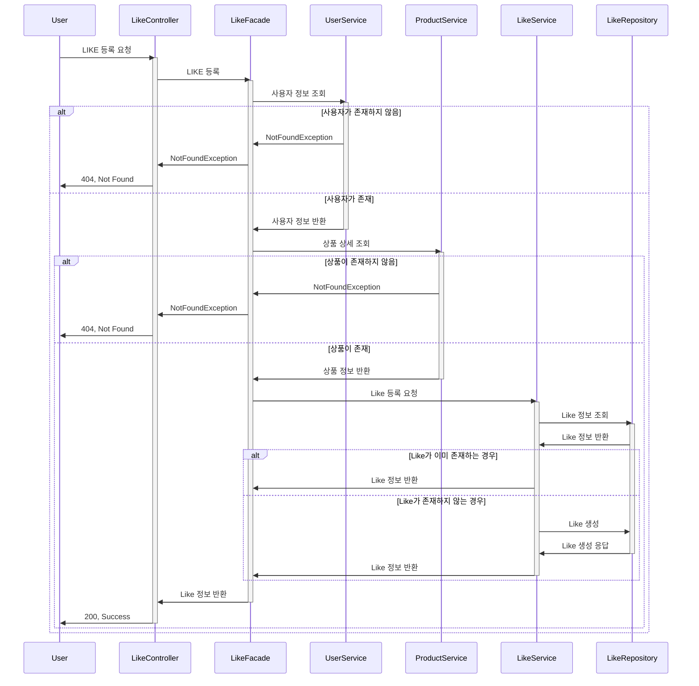
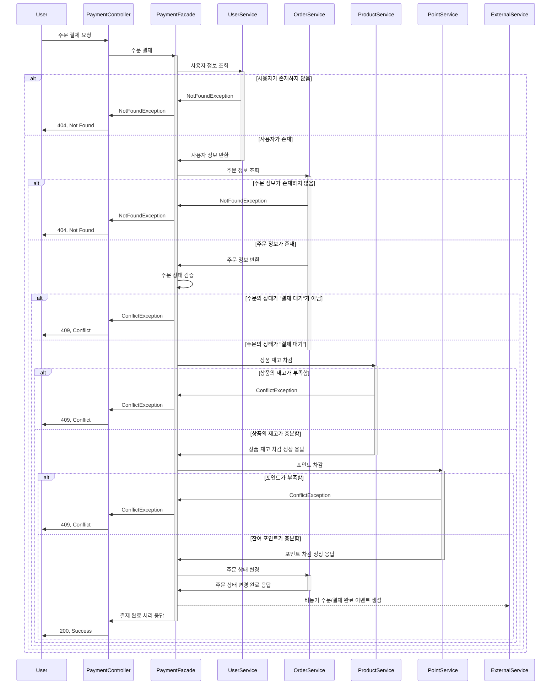

## 상품 LIKE 등록 SequenceDiagram

```mermaid
sequenceDiagram
    participant User
    participant LikeController
    participant LikeFacade
    participant UserService
    participant ProductService
    participant LikeService
    participant LikeRepository
    User ->> LikeController: LIKE 등록 요청
    activate LikeController
    LikeController ->> LikeFacade: LIKE 등록
    activate LikeFacade
    LikeFacade ->> UserService: 사용자 정보 조회
    activate UserService
    alt 사용자가 존재하지 않음
        UserService ->> LikeFacade: NotFoundException
        LikeFacade ->> LikeController: NotFoundException
        LikeController ->> User: 404, Not Found
    else 사용자가 존재
        UserService ->> LikeFacade: 사용자 정보 반환
        deactivate UserService
        LikeFacade ->> ProductService: 상품 상세 조회
        activate ProductService
        alt 상품이 존재하지 않음
            ProductService ->> LikeFacade: NotFoundException
            LikeFacade ->> LikeController: NotFoundException
            LikeController ->> User: 404, Not Found
        else 상품이 존재
            ProductService ->> LikeFacade: 상품 정보 반환
            deactivate ProductService
            LikeFacade ->> LikeService: Like 등록 요청
            activate LikeService
            LikeService ->> LikeRepository: Like 정보 조회
            activate LikeRepository
            LikeRepository ->> LikeService: Like 정보 반환 
            alt Like가 이미 존재하는 경우
                LikeService ->> LikeFacade: Like 정보 반환
            else Like가 존재하지 않는 경우
                LikeService ->> LikeRepository: Like 생성
                LikeRepository ->> LikeService: Like 생성 응답
                deactivate LikeRepository
                LikeService ->> LikeFacade: Like 정보 반환
                deactivate LikeService
            end
            LikeFacade ->> LikeController: Like 정보 반환
            deactivate LikeFacade
            LikeController ->> User: 200, Success
            deactivate LikeController
        end
    end
```

## 주문 결제 처리 SequenceDiagram

```mermaid
sequenceDiagram
    participant User
    participant PaymentController
    participant PaymentFacade
    participant UserService
    participant OrderService
    participant ProductService
    participant PointService
    participant ExternalService
    User ->> PaymentController: 주문 결제 요청
    PaymentController ->> PaymentFacade: 주문 결제
    activate PaymentFacade
    PaymentFacade ->> UserService: 사용자 정보 조회
    activate UserService
    alt 사용자가 존재하지 않음
        UserService ->> PaymentFacade: NotFoundException
        PaymentFacade ->> PaymentController: NotFoundException
        PaymentController ->> User: 404, Not Found
    else 사용자가 존재
        UserService ->> PaymentFacade: 사용자 정보 반환
        deactivate UserService
        PaymentFacade ->> OrderService: 주문 정보 조회
        activate OrderService
        alt 주문 정보가 존재하지 않음
            OrderService ->> PaymentFacade: NotFoundException
            PaymentFacade ->> PaymentController: NotFoundException
            PaymentController ->> User: 404, Not Found
        else 주문 정보가 존재
            OrderService ->> PaymentFacade: 주문 정보 반환
            PaymentFacade ->> PaymentFacade: 주문 상태 검증
            alt 주문의 상태가 "결제 대기"가 아님
                PaymentFacade ->> PaymentController: ConflictException
                PaymentController ->> User: 409, Conflict
            else 주문의 상태가 "결제 대기"
                deactivate OrderService
                PaymentFacade ->> ProductService: 상품 재고 차감
                activate ProductService
                alt 상품의 재고가 부족함
                    ProductService ->> PaymentFacade: ConflictException
                    PaymentFacade ->> PaymentController: ConflictException
                    PaymentController ->> User: 409, Conflict
                else 상품의 재고가 충분함
                    ProductService ->> PaymentFacade: 상품 재고 차감 정상 응답
                    deactivate ProductService
                    PaymentFacade ->> PointService: 포인트 차감
                    activate PointService
                    alt 포인트가 부족함
                        PointService ->> PaymentFacade: ConflictException
                        PaymentFacade ->> PaymentController: ConflictException
                        PaymentController ->> User: 409, Conflict
                    else 잔여 포인트가 충분함
                        PointService ->> PaymentFacade: 포인트 차감 정상 응답
                        deactivate PointService
                        PaymentFacade ->> OrderService: 주문 상태 변경
                        activate OrderService
                        OrderService ->> PaymentFacade: 주문 상태 변경 완료 응답
                        deactivate OrderService
                        PaymentFacade -->> ExternalService: 비동기 주문/결제 완료 이벤트 생성
                        PaymentFacade ->> PaymentController: 결제 완료 처리 응답
                        deactivate PaymentFacade
                        PaymentController ->> User: 200, Success
                    end
                end
            end
        end
    end
```