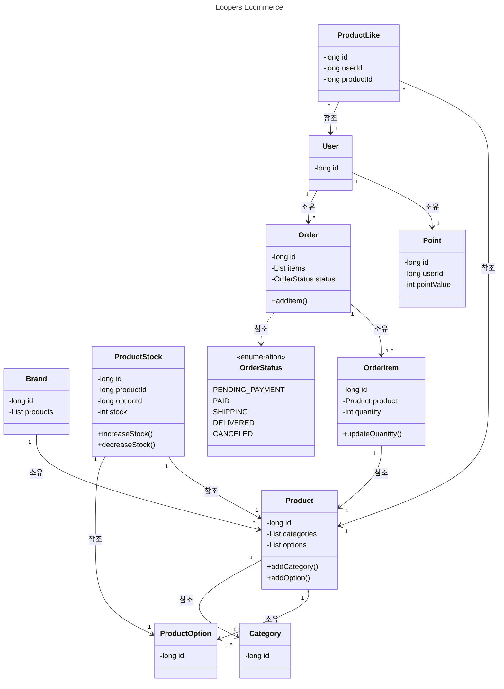

```mermaid
---
title: Loopers Ecommerce 
---

classDiagram
    class User {
        -long id
    }

%% History를 관리하고자 하는 경우에는 PointHistory 클래스/테이블이 필요할 것..
    class Point {
        -long id
        -long userId
        -int pointValue
    }

    class Brand {
        -long id
        -List<Product> products
    }

    class Product {
        -long id
        -List<Category> categories
        -List<ProductOption> options
        +addCategory()
        +addOption()
    }

    class ProductStock {
        -long id
        -long productId
        -long optionId
        -int stock
        +increaseStock()
        +decreaseStock()
    }

    class Category {
        -long id
    }

    class ProductOption {
        -long id
    }

    class ProductLike {
        -long id
        -long userId
        -long productId
    }

    class Order {
        -long id
        -List<OrderItem> items
        -OrderStatus status
        +addItem()
    }

    class OrderStatus {
        <<enumeration>>
        %% 주문 대기
        PENDING_PAYMENT
        %% 결제 완료
        PAID
        %% 배송 중
        SHIPPING
        %% 배송 완료
        DELIVERED
        %% 취소됨
        CANCELED
    }

    class OrderItem {
        -long id
        -Product product
        -int quantity
        +updateQuantity()
    }
    
    %% User
    User "1" --> "1" Point: 소유
    
    %% Product
    Brand "1" --> "*" Product: 소유
    Product "1" --> "1..*" ProductOption: 소유
    Product "1" --> "1..*" Category: 참조
    ProductStock "1" --> "1" Product: 참조
    ProductStock "1" --> "1" ProductOption: 참조
    
    %% Like
    ProductLike "*" --> "1" Product: 참조
    ProductLike "*" --> "1" User: 참조
    
    %% Order
    User "1" --> "*" Order: 소유
    Order "1" -->  "1..*" OrderItem: 소유
    Order ..> OrderStatus: 참조
    OrderItem "1" --> "1" Product: 참조
```