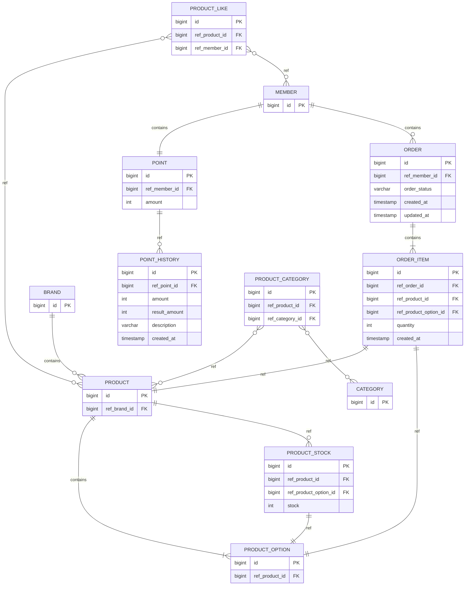

```mermaid
erDiagram
    MEMBER {
        bigint id PK
    }

    POINT {
        bigint id PK
        bigint ref_member_id FK
        int amount
    }

    POINT_HISTORY {
        bigint id PK
        bigint ref_point_id FK
        int amount
        int result_amount
        varchar description
        timestamp created_at
    }

    BRAND {
        bigint id PK
    }

    PRODUCT {
        bigint id PK
        bigint ref_brand_id FK
    }

    ORDER {
        bigint id PK
        bigint ref_member_id FK
        varchar order_status
        timestamp created_at
        timestamp updated_at
    }

    ORDER_ITEM {
        bigint id PK
        bigint ref_order_id FK
        bigint ref_product_id FK
        bigint ref_product_option_id FK
        int quantity
        timestamp created_at
    }

    PRODUCT_OPTION {
        bigint id PK
        bigint ref_product_id FK
    }

    PRODUCT_CATEGORY {
        bigint id PK
        bigint ref_product_id FK
        bigint ref_category_id FK
    }
    
    CATEGORY {
        bigint id PK
    }

    PRODUCT_STOCK {
        bigint id PK
        bigint ref_product_id FK
        bigint ref_product_option_id FK
        int stock
    }

    PRODUCT_LIKE {
        bigint id PK
        bigint ref_product_id FK
        bigint ref_member_id FK
    }
    
    %% ref == referenced
    MEMBER ||--|| POINT: contains
    MEMBER ||--o{ ORDER: contains
    POINT ||--o{ POINT_HISTORY: ref
    BRAND ||--o{ PRODUCT: contains
    PRODUCT ||--|{ PRODUCT_OPTION: contains
    PRODUCT_CATEGORY }o--o{ PRODUCT: ref
    PRODUCT_CATEGORY }o--o{ CATEGORY: ref
    PRODUCT ||--o{ PRODUCT_STOCK: ref
    PRODUCT_STOCK ||--|| PRODUCT_OPTION: ref
    PRODUCT_LIKE }o--o{ PRODUCT: ref
    PRODUCT_LIKE }o--o{ MEMBER: ref
    ORDER ||--|{ ORDER_ITEM: contains
    ORDER_ITEM ||--|| PRODUCT: ref
    ORDER_ITEM ||--|| PRODUCT_OPTION: ref
```